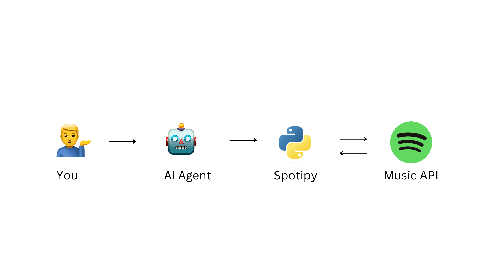

# Spotify GPT Agent

## Overview

### Demo


This is an intro to AI (LLM) Agents using LangChain. The goal is to use natural language commands towards Spotify player to be able to play certain songs. Example queries: "Play Despacito", "I know a song that goes like I was running through the six with my woes. Play me that song", etc..

Please follow the instructions below to setup the project. Play with it, and build on top of it!

## Tech Overview



- Python
- [LangChain (ReAct Agent)](https://python.langchain.com/en/latest/modules/agents.html)
- [Spotipy](https://spotipy.readthedocs.io/en/2.22.1/)
- Spotify
- OpenAI API

## Setup

1. Sign up for Spotify and Spotify API ([developer.spotify.com](developer.spotify.com))

2. Sign up for OpenAI API Key ([platform.openai.com](https://platform.openai.com/overview))

3. Create a `.env` file and put these values in

   ```
   OPENAI_API_KEY=**********************
   SPOTIFY_CLIENT_ID=*******************
   SPOTIFY_CLIENT_SECRET=***************
   SPOTIFY_REDIRECT_URI=****************
   ```

4. Create a new Python virtual environment

   - `python -m venv spotify-chat` (Mac)

   - `py -m venv spotify-chat` (Windows 11)

5. Install Python requirements in the project repository: `pip install -r requirements.txt`

## Usage

1. Open a Spotify Player (Web or Local)

2. Hit play to activate the player (otherwise Spotify Web API won't recognize it). Then pause.

3. Start virtual environment manually by running:

   - `source spotify-chat/bin/activate` (Mac)

   - `.\spotify-chat\Scripts\activate` (Windows 11)

4. Start script: In your Powershell (Windows) or Terminal (Mac), run either `py main.py` (Windows 11) or `python main.py` (Mac)

## Development

1. If new dependencies are added, add them manually to `requirements.txt`
